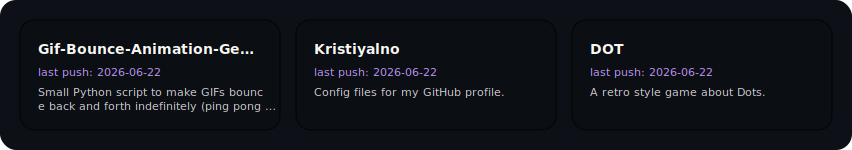

### Hi, I'm Kristiyalno _(aka Sixels)_

Discord: `kristiyalno` (same as my display name)

I never really cared about people looking in here so I'm not gonna say much.

 

#### Languages

 

#### Active Projects

<!--START_SECTION:active-repos-->

<!--END_SECTION:active-repos-->

 

 

 

#### Recent Activity

<!--START_SECTION:recent-activity-->
<!--END_SECTION:recent-activity-->

 

  

